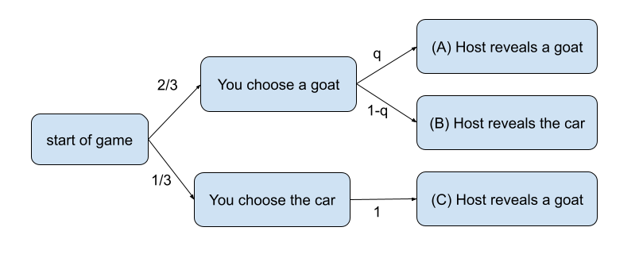

The Monty Hall Problem is usually presented like this:

> Suppose you're on a game show, and you're given the choice of three doors: Behind one door is a car; behind the others, goats. You pick a door, say No. 1, and the host, who knows what's behind the doors, opens another door, say No. 3, which has a goat. He then says to you, "Do you want to pick door No. 2?" Is it to your advantage to switch your choice?

(source: [wikipedia](https://en.wikipedia.org/wiki/Monty_Hall_problem))

You can play the game below, which tracks with the most common interpretation of the problem:

<link rel="stylesheet" href="game.css">

 

The game makes a few key assumptions:
 1. You'd prefer a car over a goat
 2. The host always opens a goat door.

You'll notice that over a large number of games, the probability of winning the car when you switch doors is around 2/3rds (67%), while the probability of winning the car when you keep the same door is around 1/3rd (33%).

Let's play a slightly different interpretation of the game:

 

This version of the game makes a few key assumptions:
 1. You'd prefer a car over a goat
 2. The host sometimes opens a goat door, but sometimes opens a car door.

If you re-read the original problem statement, you might think that the second assumption contradicts it. But the problem statement only says that the host reveals a goat _this round_. It says nothing about what the host does during other rounds of the same game show.

So obviously, the answer to the Monty Hall Problem is entirely dependent on what assumptions you make about the host. We can formalize the problem with the following flowchart:

In the above flowchart, each arrow is labelled with a probability, with q being unknown. The Monty Hall Problem is essentially asking "Is it more likely that you're in situation A (where switching would win the game), or situation B (where switching would lose the game)?"  

You could assume that q = 1 (the host always opens a goat door), which lets you calculate that the probability of A is 2/3rds and the the probability of C is 1/3rd. Or, you could assume that q = 0 (the host hates you), which lets you calculate that the probability of A is 0, so you should never switch doors. In general, switching is beneficial when p > 1/2.

